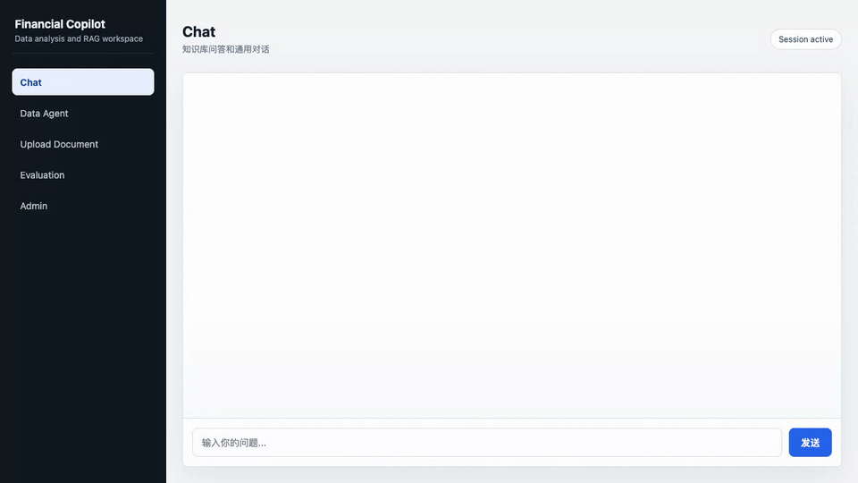
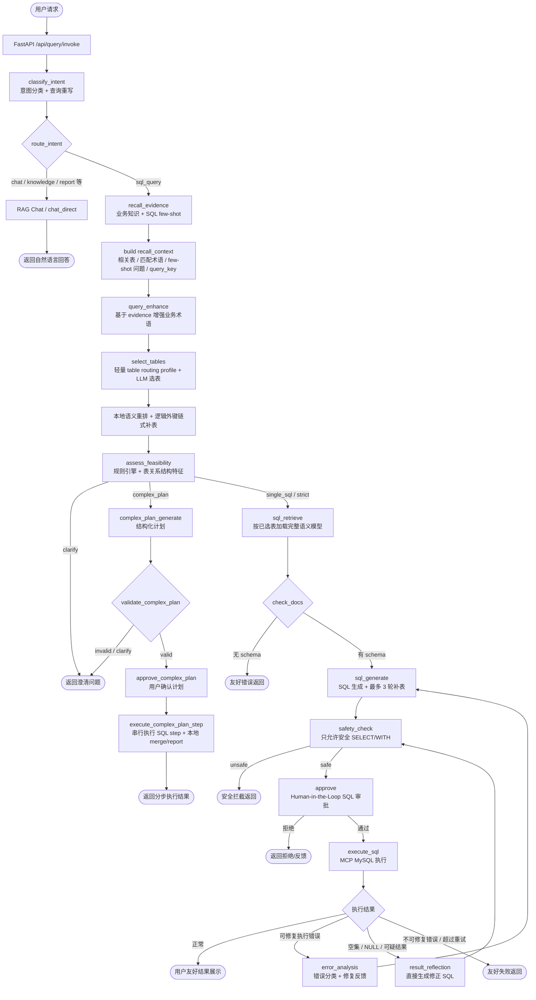

# Financial Copilot Platform

基于 **LangChain + LangGraph** 构建的财务 Copilot 平台，当前聚焦企业 NL2SQL 主链路：自然语言查数据、业务语义选表、SQL 自动生成与审批执行、复杂查询计划、数据权限门禁、合规审计、RAG 知识问答和评测闭环。

## 核心特性

- **自然语言查数据**：自然语言 -> 意图识别 -> 证据召回 -> 选表 -> SQL 生成 -> 人工审批 -> MySQL 执行，包含 SQL 安全分析、执行错误修复、异常结果反思、自动补表和用户友好结果展示。
- **多场景意图路由**：意图分类 + 查询重写合并为一次 LLM 调用，自动路由到 SQL/RAG/闲聊/报告/审计等链路，减少重复调用和历史上下文漂移。
- **可配置意图规则**：常见路由规则存储在 MySQL，通过 Admin 页面维护；规则引擎与 LLM 并行运行，最终仲裁意图，避免把业务关键词硬编码在代码中。
- **统一语义模型**：`t_semantic_model` 存储字段级业务映射（业务名/同义词/描述）+ 技术 schema（类型/注释/PK/FK/逻辑外键），Schema 权威源收敛到 MySQL/Redis。
- **表级可见语义**：为财务表、管理表、组织表维护表说明、业务域、别名和高价值字段提示，解决“用户/角色/部门”等管理表语义弱、排不进 TopK 的问题。
- **轻量选表画像**：`select_tables` 只给 LLM 表说明和当前 query 命中的少量字段提示，完整 schema 只在 `sql_retrieve -> sql_generate` 阶段按已选表加载，避免提前把全库字段塞进上下文。
- **表关系自动发现**：从 `information_schema.key_column_usage` + 语义模型逻辑外键提取 JOIN 关系，支持链式补齐桥接表、维表和端点表，例如 `t_budget -> t_cost_center -> t_department`。
- **单次召回上下文复用**：`recall_evidence` 每轮只召回一次，把当前 query 命中的业务知识、SQL few-shot、相关表、匹配术语和示例问题结构化为 `recall_context`，后续查询增强、选表和 SQL 生成复用同一份状态，减少重复召回和状态污染。
- **混合检索 RAG**：向量（Milvus）+ BM25（Elasticsearch）+ RRF 融合 + Cross-Encoder 重排序，用于业务术语、SQL few-shot 和用户文档检索。
- **业务知识 + 智能体知识**：公式/术语定义 + SQL few-shot 示例并行检索注入 prompt；业务知识支持 MySQL `term/synonyms` 兜底命中，提升财务口径稳定性。
- **查询增强**：基于业务知识翻译术语和同义表达（如“亏损多少” -> 亏损金额计算口径），提高后续检索、选表和 SQL 生成命中率。
- **Human-in-the-Loop 审批**：SQL 执行前人工确认，支持修改意见回退重生成；审批恢复使用 LangGraph `interrupt/Command(resume=...)`，SSE 展示执行、异常反思和二次确认过程。
- **执行后反思修复**：SQL 执行成功但返回空集、`NULL`、全字段空值或零值可疑结果时，进入 `result_reflection` 直接生成修正 SQL，不再回到 `sql_generate` 重新发散。
- **复杂查询模式切换**：`assess_feasibility` 不调用 LLM，基于规则引擎任务类型、关系图连通性和 JOIN 风险产出 `execution_mode`；复杂计划经用户确认后串行执行 SQL step，逐步安全检查、执行并把本地 merge/report step 写入可审计结果，避免超大 JOIN 幻觉和 token 膨胀。
- **数据权限与合规审计**：API 注入用户、角色、部门和表级权限上下文；SQL 链路在选表后、补表前、审批前和复杂计划 SQL step 中执行权限门禁，拒绝时只展示业务数据域名称，并写入 no-throw 审计事件，避免越权查询和物理表名泄露。
- **三级记忆系统**：工作记忆 + 摘要记忆 + 知识记忆（实体/事实/偏好）按 `session_id` 隔离；SQL 场景单独保存上一轮 SQL 口径，支持“亏损多少”这类多轮追问。
- **AgentScope 运行区边界**：开放式分析运行区已进入最小 runtime 迭代，但不替换 `Final Graph -> SQL React` 主链路；权限、审批、执行、审计和评测继续由 SQL Harness 负责。
- **AgentScopeRuntime 基础层**：`agents/runtime` 提供只读工具合同、任务 allowlist、权限过滤、工具调用 trace、`AgentRunResult` 结构化输出、开放探索 prompt、报告生成 prompt 和 SkillRegistry；当前不提供 SQL 执行工具。
- **链路追踪与评测闭环**：LangSmith/CozeLoop 记录 LLM、Milvus、ES、MySQL fallback、SQL 执行和审批节点；Evaluation 页面展示 Accuracy@K、Precision@K、Recall@K、MRR、NDCG、P50/P95、首字延迟和 per-query 明细。
- **安全、熔断与 Fallback**：只允许安全 `SELECT/WITH`；支持 SQLState 错误分类、可配置重试、超时控制、Redis -> MySQL fallback、检索失败降级为空 evidence。
- **SFT 扩展预留**：保留 prompt/completion 采集、教师标注、JSONL 导出模块，默认未接入在线链路，避免在样本不足时把错误 SQL 和错误口径固化进模型。
- **多模型支持**：Ark（豆包）、OpenAI、DeepSeek、通义千问、Gemini。

## AgentScope 调研边界与运行区

当前仓库的运行时仍以 `Final Graph -> SQL React` 为默认链路。AgentScope 的定位是 `Agentic Analysis Workspace`：用于开放式数据探索、复杂分析辅助规划、报告生成和 skill 扩展。

Phase 2 已新增 `AgentScopeRuntime` 最小适配层，开放 `exploratory_analysis`，通过 `ToolCatalog` 暴露只读 schema、semantic model、business knowledge 和 current time 工具。Phase 3 已新增 `report_generation`，只允许读取已有 result/artifact，并通过 `report.render` 输出 Markdown 报告和可选 ECharts 配置。

Phase 4 已新增 `SkillRegistry`，内置 `budget_variance_analysis` 和 `revenue_cost_relation` 两个 skill，支持按 task/query 自动匹配或显式启用。Skill 只能注入 prompt 和在 ToolCatalog 已允许工具内做安全交集，不能引入 SQL execution 或绕过 SQL Harness。

Phase 5 已新增 `complex_analysis` 桥接能力和 `sql_draft.submit` 工具。AgentScopeRuntime 可以生成复杂分析计划和 SQL 草稿，但草稿只会返回 `draft_only` handoff 元数据，后续必须进入 SQL Harness 的 `safety_check -> authorize_sql -> approve -> execute_sql`。

Phase 6 已新增 `ShadowBenchmark` 离线汇总组件，用于对比普通 NL2SQL、开放探索、复杂分析和报告生成的 P50/P95 延迟、LLM 调用、token、草稿通过率、审批通过率、工具失败率和最终回答可用率。严格 SQL 查询默认继续走 SQL Harness，AgentScope 只有在 shadow 指标达标时才建议启用。

真实 `agentscope` 包保持懒加载；未安装或未配置实际 runner 时返回结构化风险，不影响现有 SQL 链路。

AgentScope 不接管平台控制面：权限门禁、SQL 安全检查、人工审批、SQL 执行、审计日志和 Evaluation 回归评测继续由 SQL Harness 负责。SQL 只能作为草稿输出，并必须回到 SQL Harness 完成安全检查、授权、审批和执行。具体技术边界见 [docs/agentscope_runtime_research_plan.md](docs/agentscope_runtime_research_plan.md)。

## 功能演示（7 个端到端案例）

以下 GIF 均为本地 Web UI 录制并加速压缩，覆盖 Chat/Knowledge 路由、SQL 生成与审批执行、多轮追问、管理表关联查询、权限门禁和复杂计划执行 7 条典型案例。

### Chat / Knowledge：外部公开知识路由

在 SQL Agent 入口提问“茅台第一季度盈利”，系统识别为 Chat/Knowledge，不查询本公司数据库。



### SQL Query：去年亏损

提问“去年亏损”，系统识别为结构化数据查询，生成 SQL，经人工审批后执行并返回结果。


### 多轮追问：亏损多少

先问“去年亏损”，再追问“亏损多少”，系统会沿用上一轮 SQL 口径完成多轮 NL2SQL 追问。


### SQL Query：第一季度员工工资

提问“2026年第一季度按月统计应付职工薪酬借方和贷方金额”，系统完成意图识别、生成 SQL、审批执行，并返回按期间聚合的工资相关结果。


### SQL Query：用户与角色管理表查询

提问“查询所有用户的真实姓名以及他们被分配的角色名称”，系统命中用户、角色和用户角色绑定等管理类表语义，完成管理表关联 SQL 查询。


### Permission Gate：没有用户数据权限

同样提问“查询所有用户的真实姓名以及他们被分配的角色名称”，但当前用户只允许访问角色数据；系统在表级权限门禁处停止，返回业务数据域权限提示，不暴露物理表名，也不会进入 SQL 审批执行。


### Complex Plan：收入成本预算回款费用关系

提问“收入成本预算回款费用之间的关系”，系统命中复杂分析规则，生成结构化执行计划；用户确认后按 SQL step 串行执行，并用本地 merge/report 汇总每步结果。


## 最新节点调用流程图

当前主链路由 `Final Graph` 做意图分类与路由，SQL 查询进入 `SQL React` 子图。`recall_evidence` 每轮只召回一次，并把业务知识/few-shot 整理成 `recall_context`，后续查询增强、选表和 SQL 生成复用同一份状态。AgentScope 运行区不属于当前主执行图。



节点职责简表：

| 节点 | 作用 |
|------|------|
| `classify_intent` | 一次 LLM 调用完成意图分类和查询重写；规则引擎与 LLM 并行后仲裁 |
| `recall_evidence` | 唯一的业务知识/few-shot 召回节点，调用 Milvus/ES/MySQL fallback |
| `recall_context` | 运行态结构化证据，不是新检索；用于防止重复召回和跨节点语义漂移 |
| `select_tables` | 只给 LLM 表说明和少量命中字段提示，不提前注入完整 schema |
| `assess_feasibility` | 不调用 LLM；基于 DB 规则、关系图连通性和 JOIN 风险产出 `execution_mode` |
| `result_reflection` | 处理“执行成功但结果异常”，直接生成修正 SQL，再重新安全检查和审批 |

## 架构概览

```
┌─────────────────────────────────────────────────┐
│  API 层 (FastAPI)                                │
│  路由、SSE 流式、请求校验                          │
├─────────────────────────────────────────────────┤
│  Flow 编排层 (LangGraph)                         │
│  RAG Chat / SQL React / Analyst / Final Graph    │
├─────────────────────────────────────────────────┤
│  能力层                                          │
│  Model（LLM 工厂） / RAG（检索管线） / Tool（工具）│
├─────────────────────────────────────────────────┤
│  基础设施层                                       │
│  Config / Storage（Redis） / Algorithm（BM25/RRF）│
└─────────────────────────────────────────────────┘
```

## 项目结构

```
financial-copilot-platform/
├── pyproject.toml                  # 项目配置 + 依赖
├── .env.example                    # 环境变量模板
├── docker-compose.yaml             # 基础设施（Milvus、ES、Redis）
│
├── agents/                         # 主包
│   ├── main.py                     # 入口
│   ├── config/                     # 配置层
│   │   └── settings.py             # Pydantic Settings
│   │
│   ├── api/                        # API 层
│   │   ├── app.py                  # FastAPI 应用
│   │   ├── sse.py                  # SSE 流式响应
│   │   └── routers/                # 路由
│   │       ├── chat.py             # Chat 测试
│   │       ├── rag.py              # RAG 对话
│   │       ├── query.py            # 主调度（支持中断/恢复）
│   │       ├── document.py         # 文档上传
│   │       └── admin.py            # 语义模型 + 业务知识 CRUD
│   │
│   ├── flow/                       # LangGraph 图编排
│   │   ├── state.py                # 共享状态定义
│   │   ├── rag_chat.py             # RAG Chat 图
│   │   ├── sql_react.py            # SQL React 图（含 Human-in-the-Loop）
│   │   ├── analyst.py              # 数据分析图
│   │   └── dispatcher.py           # 意图调度图
│   │
│   ├── init/                       # 系统初始化
│   │   └── schema_sync.py          # t_semantic_model 自动同步（binlog + 轮询）
│   │
│   ├── runtime/                    # AgentScope 运行区基础层（runtime / ToolCatalog / contracts）
│   │   ├── agentscope_runtime.py   # Phase 2 最小 AgentScopeRuntime + common_analysis_agent prompt
│   │   ├── result.py               # AgentRunResult 结构化输出 + SSE 事件适配
│   │   ├── shadow_benchmark.py     # AgentScope shadow 指标汇总和启用阈值判断
│   │   ├── skill_registry.py       # Skill manifest 加载、内置 skill 和安全工具边界
│   │   ├── tool_catalog.py         # 受控只读工具注册表 + allowlist + 权限过滤
│   │   └── tool_contracts.py       # 工具合同、调用结果和 trace 结构
│   │
│   ├── model/                      # 模型抽象层
│   │   ├── chat_model.py           # Chat Model 工厂
│   │   ├── embedding_model.py      # Embedding Model 工厂
│   │   ├── format_tool.py          # 结构化输出工具
│   │   └── providers/              # 各提供商实现
│   │       ├── ark.py              # 火山引擎 Ark（豆包）
│   │       ├── openai.py           # OpenAI
│   │       ├── deepseek.py         # DeepSeek
│   │       ├── qwen.py             # 通义千问
│   │       └── gemini.py           # Google Gemini
│   │
│   ├── rag/                        # RAG 管线
│   │   ├── indexing.py             # 文档索引（Loader → Splitter → Store）
│   │   ├── retriever.py            # 混合检索（Milvus + ES BM25 + RRF）
│   │   ├── domain_summary_builder.py # 基于语义模型生成领域摘要
│   │   ├── parent_retriever.py     # Parent Document RAG
│   │   ├── reranker.py             # Cross-Encoder 重排序
│   │   ├── query_rewrite.py        # 查询重写（指代消解）
│   │   └── schema_indexer.py       # 旧版 mysql_schema 向量索引兼容入口（默认禁用）
│   │
│   ├── tool/                       # 工具层
│   │   ├── registry.py             # 统一 Tool Registry
│   │   ├── memory/                 # 三级记忆系统
│   │   ├── storage/                # 存储层
│   │   │   ├── redis_client.py     # Redis 连接
│   │   │   ├── checkpoint.py       # LangGraph Checkpointer
│   │   │   ├── domain_summary.py   # 领域摘要持久化
│   │   │   ├── intent_rules.py     # 可配置意图规则
│   │   │   └── doc_metadata.py     # 文档元数据（MySQL）
│   │   ├── document/               # 文档处理
│   │   ├── sql_tools/              # SQL 工具
│   │   │   ├── mcp_client.py       # MCP 客户端
│   │   │   ├── execute_tool.py     # @tool: execute_query
│   │   │   ├── schema_tool.py      # @tool: list_tables, describe_table
│   │   │   ├── safety.py           # SQL 安全分析
│   │   │   └── error_codes.py      # 错误码分类 + is_retryable()
│   │   ├── analyst_tools/          # 数据分析
│   │   ├── sft/                    # SFT 扩展预留（默认未启用）
│   │   └── trace/                  # 可观测性
│   │
│   ├── algorithm/                  # 算法
│   │   ├── bm25.py                 # BM25 实现
│   │   └── rrf.py                  # RRF 融合
│   │
│   └── static/                     # 前端
│       └── index.html              # Chat + SQL Agent + 文档上传 UI
│
├── tests/                          # 测试
├── docs/                           # 技术文档
│   ├── iterations.md               # 迭代优化记录
│   └── resilience_design.md        # 熔断降级与 Fallback 设计
├── python_langchain_design.md       # 技术设计文档
│
└── data/                           # 数据目录
    └── sft/                        # SFT 导出数据（预留）
```

## 快速开始

### 1. 环境准备

```bash
# Python 3.11+
python -m venv .venv
source .venv/bin/activate
pip install -e .

# 如需链路追踪（CozeLoop）
pip install cozeloop
```

### 2. 启动基础设施

```bash
docker-compose up -d
```

启动以下服务：
| 服务 | 端口 | 说明 |
|------|------|------|
| Milvus | 19530 | 向量数据库 |
| Attu | 8000 | Milvus Web UI |
| Elasticsearch | 9200 | 全文检索 |
| Redis | 6379 | 缓存 + CheckPoint |
| MinIO | 9000/9001 | Milvus 对象存储 |

### 3. 配置环境变量

```bash
cp .env.example .env
# 编辑 .env 填入你的 API Key
```

必须配置的变量：

```bash
# 模型（至少配置一个）
CHAT_MODEL_TYPE=ark
ARK_KEY=your-ark-key
ARK_CHAT_MODEL=doubao-seed-2-0-code-preview-260215

# Embedding
EMBEDDING_MODEL_TYPE=qwen
QWEN_KEY=your-qwen-key
QWEN_EMBEDDING_MODEL=text-embedding-v3

# 向量数据库
MILVUS_ADDR=localhost:19530

# ES
ES_ADDRESS=http://localhost:9200

# Redis
REDIS_ADDR=localhost:6379
```

### 4. 启动服务

```bash
# 方式 1：直接运行
python -m agents.main

# 方式 2：uvicorn
uvicorn agents.api.app:app --host 0.0.0.0 --port 8080 --reload
```

服务启动后访问：

| 页面 | 路径 | 说明 |
|------|------|------|
| Chat UI | http://localhost:8080/ | RAG 对话（Tab 1） |
| SQL Agent | http://localhost:8080/ | 意图路由 + SQL 生成（Tab 2） |
| 文档上传 | http://localhost:8080/ | 上传文档并索引到 RAG（Tab 3） |
| Admin | http://localhost:8080/ | 意图规则 / 语义模型 / 业务知识 / 智能体知识管理（Tab 5） |
| API 文档 | http://localhost:8080/docs | Swagger UI |
| 健康检查 | http://localhost:8080/health | 服务状态 |

## 配置治理教程

服务启动后打开 `http://localhost:8080/`，进入 `Admin` Tab。这里维护的是运行时可调整的语义资产和规则信号，目标是把业务口径、路由规则和 SQL 示例放到 MySQL/Admin 中治理，而不是写死在 Python 代码里。企业 NL2SQL 的人工治理不只包括字段语义，还包括黄金评测集、业务口径、SQL few-shot、意图匹配规则和复杂查询路由规则；每次修复失败 case 后，都应把样本回流到评测集中做回归验证。

#### 1. 语义模型：让字段能被业务语言命中

语义模型对应 MySQL `t_semantic_model`，用于把物理 schema 变成 NL2SQL 可理解的字段画像。技术 schema（字段类型、注释、PK/FK）由 `schema_sync` 监听 MySQL binlog DDL 做增量同步，并用 `information_schema` 轮询兜底，更新后刷新 Redis 缓存。业务字段可以在 Admin 页面补充。

| 字段 | 用途 | 示例 |
|------|------|------|
| `table_name` / `column_name` | 定位物理字段 | `t_budget.cost_center_id` |
| `business_name` | 字段业务名称，参与选表画像和 SQL 生成理解 | `成本中心ID` |
| `synonyms` | 用户可能使用的说法，逗号分隔 | `部门,责任中心` |
| `business_description` | 枚举、计算逻辑、关联说明 | `关联 t_cost_center.id，表示预算归属成本中心` |

案例：用户问“查询各部门年度预算总金额”时，`t_budget.cost_center_id` 的同义词包含“部门”，`t_cost_center.department_id` 又通过逻辑外键指向 `t_department.id`。运行时 `select_tables` 会先用这些字段提示帮助 LLM 选表，再用 `ref_table/ref_column` 构建 Schema Graph，补齐 `t_budget -> t_cost_center -> t_department`。

注意：Admin 页面主要维护业务名、同义词和描述；逻辑外键 `is_fk/ref_table/ref_column` 通常通过 schema sync 或 Admin 治理维护。运行时 binlog 主要跟踪表结构 DDL 变化，业务语义仍需要配置化治理，避免手工漏配 JOIN 关系。

#### 2. 业务知识：让指标口径稳定

业务知识对应 `t_business_knowledge`，用于解释“亏损”“毛利率”“费用总额”等业务术语。它会被写入 MySQL，并可重新索引到 Milvus/ES，运行时由 `recall_evidence` 召回后进入 `recall_context`、`query_enhance` 和 `sql_generate`。

| 字段 | 用途 | 示例 |
|------|------|------|
| `term` | 标准业务术语 | `亏损金额` |
| `formula` | 口径或计算公式 | `净利润 < 0 时为 ABS(净利润)，否则为 0` |
| `synonyms` | 用户说法 | `亏损多少,亏了多少,亏损额` |
| `related_tables` | 该口径常涉及的表，逗号分隔 | `t_journal_entry,t_journal_item,t_account` |

案例：用户问“去年亏损多少”，业务知识会把“亏损多少”映射为“亏损金额”口径，避免 LLM 只返回净利润字段，或把 `0` 错误归入亏损。`related_tables` 也会作为选表重排信号，帮助相关表进入 TopK。

更新业务知识后，如果需要让向量/BM25 检索立即使用新内容，点击 Admin 的 reindex，或调用：

```bash
curl -X POST http://localhost:8080/api/admin/business-knowledge/reindex
```

#### 3. 智能体知识：沉淀高质量 SQL few-shot

智能体知识对应 `t_agent_knowledge`，用于保存“自然语言问题 -> 参考 SQL”的 few-shot 示例。它适合沉淀已经验证过的高质量 SQL，不适合保存偶然生成但未验证的 SQL。

| 字段 | 用途 | 示例 |
|------|------|------|
| `question` | 相似问题 | `查询各部门年度预算和实际发生额对比` |
| `sql_text` | 已验证 SQL | `SELECT d.name, SUM(b.budget_amount) ...` |
| `description` | 适用场景说明 | `预算按部门聚合，需经过成本中心关联部门` |
| `category` | 分类 | `budget_analysis` |

案例：当用户问“2025 年按部门对比预算金额、实际发生额和已审批报销金额”时，few-shot 可以提供类似的 `FROM/JOIN/GROUP BY` 写法。系统会解析示例 SQL 中的 `FROM/JOIN` 表，把这些表写入 `recall_context.few_shot_related_tables`，用于选表重排和 SQL 生成参考。

更新 SQL few-shot 后，重新索引：

```bash
curl -X POST http://localhost:8080/api/admin/agent-knowledge/reindex
```

#### 4. 意图规则：把高确定性入口路由沉淀为配置

意图规则对应 `t_intent_rule`，用于在 LLM 意图识别之外提供确定性规则信号。规则与 LLM 并行执行，仲裁后决定进入 `sql_query`、`chat`、`knowledge`、`report` 等链路。

| 字段 | 用途 | 示例 |
|------|------|------|
| `target_intent` | 命中后建议的目标意图 | `sql_query` |
| `match_type` | 匹配方式：`contains` / `exact` / `regex` | `contains` |
| `pattern` | 关键词、完整问题或正则 | `查询` |
| `rewrite_template` | 可选重写模板，`{query}` 表示原问题 | `公司{query}` |
| `priority` | 规则排序，值越大越先匹配 | `100` |
| `confidence` | 人工配置的规则可靠度，不是模型计算分 | `0.95` |

案例：用户问“第一季度毛利率”，问题缺少主体，LLM 可能理解成公开公司知识问答。可以配置：

```text
target_intent: sql_query
match_type: regex
pattern: .*毛利率.*
rewrite_template: 公司{query}
priority: 120
confidence: 0.95
```

命中后系统会更稳定地进入 SQL 链路，并把问题补齐为“公司第一季度毛利率”。低置信规则可以保留但降低 `confidence`，由 dispatcher 的规则与 LLM 仲裁决定是否采用。

#### 5. 复杂查询路由规则：给可行性评估提供任务类型

复杂查询路由规则对应 `t_query_route_rule`。运行时不会再调用 LLM 判断复杂路由，而是由规则引擎给 `assess_feasibility` 提供 `task_type` 证据，再结合关系图连通性、是否存在多条 JOIN 路径和计划自洽性计算最终 `execution_mode`。表数量只作为观测指标，不作为路由阈值。

| 字段 | 用途 | 示例 |
|------|------|------|
| `route_signal` | 兼容字段名，运行时解释为 `task_type`：`analysis` / `report` / `comparison` 可拆分；`detail` / `export` / `sensitive` 先澄清 | `analysis` |
| `match_type` | 匹配方式：`contains` / `exact` / `regex` | `regex` |
| `pattern` | 命中的查询表达式 | `.*收入.*成本.*预算.*关系.*` |
| `priority` | 多条规则命中时的排序，值越大越先匹配 | `150` |
| `confidence` | 人工配置的规则可靠度；当前代码中 `>= 0.8` 才采用为可行性评估证据 | `0.95` |

案例 A：复杂分析问题进入计划模式。

```text
name: 收入成本预算关系分析
route_signal: analysis
match_type: regex
pattern: .*收入.*成本.*预算.*关系.*
priority: 150
confidence: 0.95
enabled: true
```

当用户问“分析今年收入、成本、预算、费用报销之间的关系”，系统会先命中规则，得到 `task_type=analysis`。`assess_feasibility` 会根据该任务类型产出 `execution_mode=complex_plan`，然后进入 `complex_plan_generate`。Planner 会输出 `sql / python_merge / report` 结构化步骤，并校验表白名单、步骤依赖、`merge_keys` 和步骤上限，最后交给用户确认。

案例 B：明细导出问题先澄清。

```text
name: 大范围明细导出
route_signal: export
match_type: contains
pattern: 导出
priority: 120
confidence: 0.9
enabled: true
```

当用户问“导出所有部门、角色、用户、报销、预算、发票明细”时，系统不会为了满足请求直接生成超大 JOIN，而是进入 `clarify`，提示用户指定时间、部门、指标或缩小范围。

`confidence` 当前不是在线计算出来的分数，而是规则治理字段。建议配置原则：

- `0.9~1.0`：表达非常明确、误伤低的规则，可以直接采用。
- `0.8~0.89`：较可靠，但仍建议结合评测观察。
- `<0.8`：保留为弱信号，不作为 `assess_feasibility` 的任务类型证据，运行时回退到默认结构评估。

### 评测数据与报告

```bash
# 从 t_semantic_model 生成 schema 评测数据集
python -m agents.eval.cli generate --num-per-table 3 --output data/eval/eval_dataset.jsonl

# 运行召回评测并生成报告
python -m agents.eval.cli run --dataset data/eval/eval_dataset.jsonl --output data/eval/eval_report.json

# 首次准备 NL2SQL 端到端回放样本模板
python -m agents.eval.cli run-nl2sql --dataset data/eval/nl2sql_cases.jsonl --init-template

# 填写真实 generated_sql / actual_result / expected_result 后运行端到端结果评测
python -m agents.eval.cli run-nl2sql --dataset data/eval/nl2sql_cases.jsonl --output data/eval/nl2sql_eval_report.json

# 首次准备在线 NL2SQL 回放样本模板
python -m agents.eval.cli run-online-nl2sql --dataset data/eval/online_nl2sql_cases.jsonl --init-template

# 真实调用 Agent，到 SQL 审批中断为止
python -m agents.eval.cli run-online-nl2sql --dataset data/eval/online_nl2sql_cases.jsonl --output data/eval/online_nl2sql_eval_report.json

# 测试库中自动审批并执行 SQL
python -m agents.eval.cli run-online-nl2sql --dataset data/eval/online_nl2sql_cases.jsonl --output data/eval/online_nl2sql_eval_report.json --auto-approve-sql
```

这些命令的区别：

| 命令 | 作用 | 输出 |
|------|------|------|
| `generate` | 基于 MySQL `t_semantic_model` 和 LLM 生成自然语言 query，并标注标准相关表 `relevant_doc_ids` | `eval_dataset.jsonl` |
| `run` | 对数据集里的 query 执行召回策略，把实际召回表和标准相关表对比，计算 Accuracy、Recall、MRR、NDCG、延迟等指标 | `eval_report.json` |
| `run-nl2sql` | 对已有 NL2SQL 回放样本计算 SQL 有效率、执行成功率、结果匹配率、延迟和首字延迟 | `nl2sql_eval_report.json` |
| `run-online-nl2sql` | 真实调用线上 Agent 回放自然语言 query，可停在审批中断，也可自动审批后执行 SQL | `online_nl2sql_eval_report.json` |

`run` 默认评测：

- `schema_lexical`：本地 schema metadata 词法召回基线。
- `schema_table_name`：只看表名的对照组。
- `business_knowledge_recall`：业务知识召回，只有数据集带 `relevant_business_doc_ids` 时计算。
- `agent_knowledge_recall`：SQL few-shot 召回，只有数据集带 `relevant_agent_doc_ids` 时计算。

线上选表前置链路 `preselect_pipeline` 会执行 `recall_evidence -> recall_context -> query_enhance -> select_tables`，其中 `recall_evidence` 每轮只召回一次，后续节点复用 state 中的结构化证据；该链路可能调用外部 LLM。需要评测真实线上链路时显式开启：

```bash
python -m agents.eval.cli run \
  --dataset data/eval/eval_dataset.jsonl \
  --output data/eval/eval_report.json \
  --include-online-pipeline
```

最近一次全量线上预选链路评测（`eval_dataset.jsonl`，45 条，2026-05-13）：

| 策略 | 样本数 | MRR | Accuracy@5 | Recall@5 | NDCG@5 | P50/P95 延迟 |
|------|------:|----:|-----------:|---------:|-------:|-------------:|
| `schema_lexical` | 45 | 96.67% | 77.78% | 90.63% | 90.03% | 0.0 / 0.1 ms |
| `preselect_pipeline` | 45 | 96.67% | 88.89% | 94.07% | 94.13% | 7426.8 / 10541.4 ms |

管理表专项线上评测（12 条）中，`preselect_pipeline` 的 `Recall@5` 和 `MRR` 均为 `100%`；该专项指标不等同于全量业务指标。

默认不再加载旧版 Milvus/ES schema 文档检索和 CrossEncoder reranker。完整原理、指标解释和报告格式见 [评测体系设计](docs/evaluation_design.md)。

评测集默认排除 `domain_summary`、`t_semantic_model` 等系统内部表，避免把 Agent 元数据表误当成业务查询目标。

`generate` 默认还会基于本地 `t_business_knowledge` 和 `t_agent_knowledge` 补充可选标注字段：

- `relevant_business_doc_ids`
- `relevant_agent_doc_ids`

这一步是本地字符串/词法匹配，不调用 LLM。如需关闭：

```bash
python -m agents.eval.cli generate \
  --num-per-table 3 \
  --output data/eval/eval_dataset.jsonl \
  --no-knowledge-labels
```

`run-nl2sql` 不会调用线上 Agent，也不会执行数据库，只评测已记录样本。如果样本文件还不存在，先执行：

```bash
python -m agents.eval.cli run-nl2sql \
  --dataset data/eval/nl2sql_cases.jsonl \
  --init-template
```

然后把模板里的 `generated_sql`、`actual_result`、`expected_result` 替换为真实回放 case。样本格式：

```json
{"query":"去年亏损多少","generated_sql":"SELECT ...;","actual_result":[{"loss_amount":"100.00"}],"expected_result":[{"loss_amount":"100.00"}],"latency_ms":1200,"first_token_latency_ms":350}
```

`run-online-nl2sql` 会调用真实 Agent，适合测试线上链路。默认强制 `intent=sql_query`，避免把意图分类混入 SQL 生成指标；如需完整调度链路，加 `--full-dispatch`。默认不自动审批 SQL，只记录首个审批中断和生成 SQL；如需执行到结果，加 `--auto-approve-sql`，建议只在测试库或只读账号上使用。

### 业务知识配置

业务知识应通过 Admin 页面或管理 API 维护。修改业务术语、公式、同义词后，触发业务知识重建索引，让 Milvus/ES 检索立即使用新内容：

```bash
curl -X POST http://localhost:8080/api/admin/business-knowledge/reindex
```

如果不同项目有不同业务口径，建议沉淀为项目级配置数据，再通过 Admin/API 导入到 `t_business_knowledge`。

JSON 格式：

```json
[
  {
    "term": "业务术语",
    "formula": "公式或口径说明",
    "synonyms": "同义词1, 同义词2",
    "related_tables": "t_table_a,t_table_b"
  }
]
```

### 执行前提

- MySQL、Milvus、Elasticsearch 已启动。
- `.env` 里配置了 MySQL、Embedding 模型、Milvus、ES。
- 业务知识和 SQL few-shot 重建索引需要 Embedding 配置可用，因为会写向量索引。
- 如果只想先打开前端和 API，可以先启动服务；但 SQL Agent 的业务增强和 few-shot 质量依赖 Admin 中维护的语义资产。

## API 接口

### Chat 测试

```bash
# 非流式
curl -X POST http://localhost:8080/api/chat/test \
  -H "Content-Type: application/json" \
  -d '{"question": "你好", "history": []}'

# 流式（SSE）
curl -X POST http://localhost:8080/api/chat/test/stream \
  -H "Content-Type: application/json" \
  -d '{"question": "介绍一下自己"}'
```

### RAG 对话

```bash
# 文档索引
curl -X POST http://localhost:8080/api/rag/insert \
  -F "file=@document.pdf"

# RAG 问答
curl -X POST http://localhost:8080/api/rag/ask \
  -H "Content-Type: application/json" \
  -d '{"query": "文档中提到了什么？", "session_id": "user1"}'

# RAG 流式对话
curl -X POST http://localhost:8080/api/rag/chat/stream \
  -H "Content-Type: application/json" \
  -d '{"query": "继续刚才的话题", "session_id": "user1"}'
```

### 主调度（意图路由）

```bash
# 自动分类意图：SQL 查询 vs 普通对话
curl -X POST http://localhost:8080/api/final/invoke \
  -H "Content-Type: application/json" \
  -d '{"query": "查询最近 7 天的订单数量", "session_id": "user1"}'

# 流式（前端默认，含 SQL 审批事件）
curl -X POST http://localhost:8080/api/final/invoke/stream \
  -H "Content-Type: application/json" \
  -d '{"query": "查询最近 7 天的订单数量", "session_id": "user1"}'
```

### 文档上传

```bash
# 上传文档并索引（默认 RAG 模式）
curl -X POST http://localhost:8080/api/document/insert \
  -F "file=@document.pdf"

# 指定 Parent Document RAG 模式
curl -X POST http://localhost:8080/api/document/insert \
  -F "file=@document.pdf" \
  -F "rag_mode=parent"
```

## 核心设计

前面的“核心特性”和“最新节点调用流程图”是当前能力与主链路的权威说明。本节只保留实现层补充，避免重复描述同一条 SQL React 流程。

### 1. LangGraph 状态编排

业务流程由 **StateGraph** 组织，节点间通过 TypedDict 共享运行态。外层 `Final Graph` 负责意图分类与路由，SQL 查询进入 `SQL React` 子图；审批、复杂计划确认和反思修正依赖 LangGraph `interrupt/Command(resume=...)` 做中断恢复。

这种拆分让主链路保持可观测、可恢复，也让 `recall_context`、选表结果、权限上下文和 SQL 审批状态可以在节点间明确传递，减少跨节点重复检索和隐式状态污染。

### 2. 检索数据源分工

当前项目把“结构化元数据”和“非结构化知识”分开存储，避免用向量库承担精确 schema 查询。

| 数据 | 存储位置 | 检索方式 | 使用节点 | 为什么这样查 |
|------|----------|----------|----------|--------------|
| 表名、表注释 | Redis `schema:table_metadata`；miss 后查 MySQL `information_schema.tables` | 精确读取候选表，再由 LLM 精选 | `select_tables` | 表名是结构化元数据，要求完整、实时、可解释，不适合靠向量相似度召回 |
| 字段类型、字段注释、PK/FK、业务名、同义词、业务描述 | Redis `schema:semantic_model:<table>`；miss 后查 MySQL `t_semantic_model` | 选表阶段只取少量命中字段做 routing profile；SQL 生成阶段按已选表完整加载 | `select_tables`、`sql_retrieve`、自动补表 | 选表需要轻量提示，SQL 生成才需要完整 schema，避免提前消耗大量 token |
| 表关系、JOIN 关系 | MySQL `t_semantic_model` 的逻辑外键 + `information_schema.key_column_usage` | 按表名精确查询 | `select_tables`、`sql_generate` | JOIN 条件必须确定，不能依赖向量相似度推断 |
| 业务术语、公式、同义词 | MySQL `t_business_knowledge` + Milvus `source=business_knowledge` + ES `metadata.source=business_knowledge` | 每轮 query 只在 `recall_evidence` 召回一次：Milvus 向量 + ES BM25 + RRF；不足时 MySQL term/synonyms 兜底；结果写入 `recall_context` | `recall_evidence`、`query_enhance`、`select_tables`、`sql_generate` | 用户表达可能口语化，向量适合语义近似，BM25 适合关键词命中；结构化 `recall_context` 避免后续节点重复召回 |
| SQL few-shot 示例 | MySQL `t_agent_knowledge` + Milvus `source=agent_knowledge` + ES `metadata.source=agent_knowledge` | 每轮 query 只在 `recall_evidence` 召回一次，解析 SQL 中的 FROM/JOIN 表和示例问题写入 `recall_context` | `recall_evidence`、`select_tables`、`sql_generate` | 示例 SQL 是非结构化知识，向量找相似问题，BM25 命中表名/字段名/指标词；选表阶段复用示例表证据 |
| 用户上传文档 | Milvus/ES 文档索引 | RAG 检索、重排 | RAG Chat 流程 | 文档内容天然非结构化，适合向量语义召回 + 关键词召回 |
| 会话状态、checkpoint、schema 缓存、领域摘要缓存 | Redis | key-value 精确读取 | API、LangGraph、schema sync | 高频状态数据需要低延迟读写，Redis 作为缓存和会话存储 |
| 实际业务数据 | MySQL 业务表 | LLM 生成 SELECT，经审批后由 MCP MySQL 执行 | `execute_sql` | MySQL 是业务数据权威来源，SQL 执行前必须经过安全检查和人工确认 |

`source=mysql_schema` 的 Milvus/ES 记录是旧版 schema 向量检索遗留数据。当前 NL2SQL 不再读取这些记录；清理后，Milvus/ES 只保留业务知识、SQL few-shot、用户文档等非结构化检索数据，schema 统一由 Redis/MySQL 提供。

### 3. 三级记忆系统

| 层级 | 存储 | 内容 | 触发方式 |
|------|------|------|----------|
| 短期记忆 | `Session.history` 滑动窗口 | 最近 `MEMORY_SHORT_WINDOW_MESSAGES` 条消息，直接注入意图识别/重写 | 每轮读取时裁剪 |
| 中期记忆 | `Session.summary` | LLM 将旧消息和已有摘要合并后的滚动摘要 | 历史超过 `MEMORY_SUMMARY_MAX_HISTORY_LEN` 后异步压缩 |
| 长期记忆 | Milvus `source=conversation_memory` | 被压缩归档的旧对话，按 `session_id` 隔离 | 压缩成功后写入向量库，后续按当前 query 语义召回 |

**压缩与召回流程：**
1. 每轮完成后保存 Q&A 到 session。
2. 后台 memory manager 判断历史长度，超过阈值时保留最近 `MEMORY_SUMMARY_KEEP_RECENT` 条。
3. 旧消息与已有摘要合并成新的 `Session.summary`。
4. 被归档的旧消息写入 Milvus 长期记忆。
5. 后续查询只携带短期窗口 + 摘要；如果当前 session 有长期记忆，再按 query 召回相关归档片段。

结构化实体、事实、偏好提取模块仍保留为扩展能力，适合后续把稳定用户偏好或业务事实沉淀为更可控的长期记忆。

### 4. 安全执行与结果自修正

- SQL 安全检查只允许安全 `SELECT/WITH`，拦截 DROP、TRUNCATE、DELETE、UPDATE 和 always-true 条件等高风险语句。
- 权限门禁在选表后、补表前、审批前和复杂计划 SQL step 中执行，拒绝时只展示业务数据域名称并写入审计事件。
- 执行失败时，`is_retryable()` 判断错误类型，可重试错误进入 `error_analysis → sql_generate`
- 执行成功但结果异常（空集、`NULL`、包装结构中的 `rows: []` 等）进入 `result_reflection`
- `result_reflection` 直接生成修正后的 SQL，然后走 `safety_check → approve → execute_sql`，不再重复进入 `sql_generate`
- 审批恢复使用 SSE 展示“执行中 → 异常检测 → 反思生成修正 SQL → 等待确认”的过程，避免用户误以为重复审批同一条 SQL
- `query` 和 `rewritten_query` 使用 `latest_non_empty` reducer，允许新一轮非空 query 覆盖旧 checkpoint，approve/resume 没有新值时保留当前值，避免 LangGraph 并发更新错误

### 5. Token 预算管理

```python
counter = TokenCounter()
parts = [summary, history, docs, query]
fitted = counter.fit_to_budget(parts, max_tokens=28672)
# 自动裁剪低优先级内容，防止超出上下文窗口
```

### 6. SFT 扩展预留

```
ChatModel 调用 → SFTHandler 采集 → 教师模型评分/修正 → JSONL 导出
```

当前项目主要依赖外部大模型完成意图识别、SQL 生成和结果反思，暂时没有微调小模型的刚性需求。因此 SFT 模块作为可扩展能力保留，**默认未接入在线链路，也不会自动采集每次 LLM 调用**。

保留模块的用途：

- 后续需要微调时，可通过 `SFTCallbackHandler` 采集 prompt/completion。
- 可用教师模型对样本评分并生成修订答案。
- 可导出 JSONL，用于离线训练或评测。

如果要正式启用，需要补充配置开关、持久化样本表、采集范围控制和隐私脱敏策略，避免在线请求无感记录敏感业务数据。

## 配置说明

### 模型配置

```bash
# 主模型（用于生成、SQL、分析）
CHAT_MODEL_TYPE=ark          # ark / openai / deepseek / qwen / gemini

# Embedding 模型（用于向量化）
EMBEDDING_MODEL_TYPE=qwen    # ark / openai / qwen / gemini
```

### RAG 参数

```bash
CHUNK_SIZE=1000              # 分块大小（字符数）
CHUNK_OVERLAP=200            # 分块重叠
TOP_K=5                      # 检索返回文档数

# Reranker（Cross-Encoder 重排序）
RAG_RERANKER_MODEL=BAAI/bge-reranker-v2-m3   # 空字符串禁用
RAG_RERANKER_TOP_K=5                          # 重排序后保留文档数
RAG_RERANK_THRESHOLD=0.1                      # 最低分数阈值
```

### 记忆参数

```bash
MAX_HISTORY_LEN=3            # 保留最近 N 轮对话
```

### 链路追踪

LangSmith 通过环境变量自动启用，CozeLoop 需额外安装：

```bash
pip install cozeloop
```

`.env` 配置：

```bash
# LangSmith
LANGSMITH_TRACING=true
LANGSMITH_API_KEY=your-key

# CozeLoop (JWT OAuth)
COZELOOP_TRACING=true
COZELOOP_WORKSPACE_ID=your-workspace-id
COZELOOP_JWT_OAUTH_CLIENT_ID=your-client-id
COZELOOP_JWT_OAUTH_PRIVATE_KEY=your-private-key
COZELOOP_JWT_OAUTH_PUBLIC_KEY_ID=your-public-key-id
```

追踪粒度覆盖：

- 图节点：LangGraph 自动记录。
- LLM 子调用：意图分类、查询重写、query_enhance、select_tables、sql_generate、error_analysis、result_reflection、RAG chat、Analyst 报告生成。
- 检索/存储子调用：Milvus 向量检索、Elasticsearch BM25、业务知识 MySQL fallback、schema Redis/MySQL 元数据加载。

## Docker 部署

```bash
# 启动所有基础设施
docker-compose up -d

# 查看服务状态
docker-compose ps

# 查看日志
docker-compose logs -f milvus
```

## 技术文档

- [设计文档](python_langchain_design.md)
- [评测体系设计](docs/evaluation_design.md)
- [评测使用手册](docs/evaluation_user_guide.md)
- [迭代优化记录](docs/iterations.md)
- [熔断降级与 Fallback 设计](docs/resilience_design.md)
- [财务 NL2SQL 微调方案](docs/sql_finetuning_plan.md)
- [新手教学文档](TUTORIAL.md)

## 依赖说明

| 库 | 用途 |
|----|------|
| `langchain` + `langgraph` | LLM 抽象 + 图编排 |
| `langchain-milvus` | Milvus 向量存储 |
| `langchain-elasticsearch` | ES 检索 |
| `sentence-transformers` | Cross-Encoder 重排序 |
| `tiktoken` | Token 计数 |
| `fastapi` + `uvicorn` | HTTP 服务 |
| `sse-starlette` | SSE 流式响应 |
| `mcp` | MCP 协议（SQL 执行） |
| `pydantic-settings` | 配置管理 |
| `redis` | 缓存 + CheckPoint |

## License

See [LICENSE](LICENSE).
