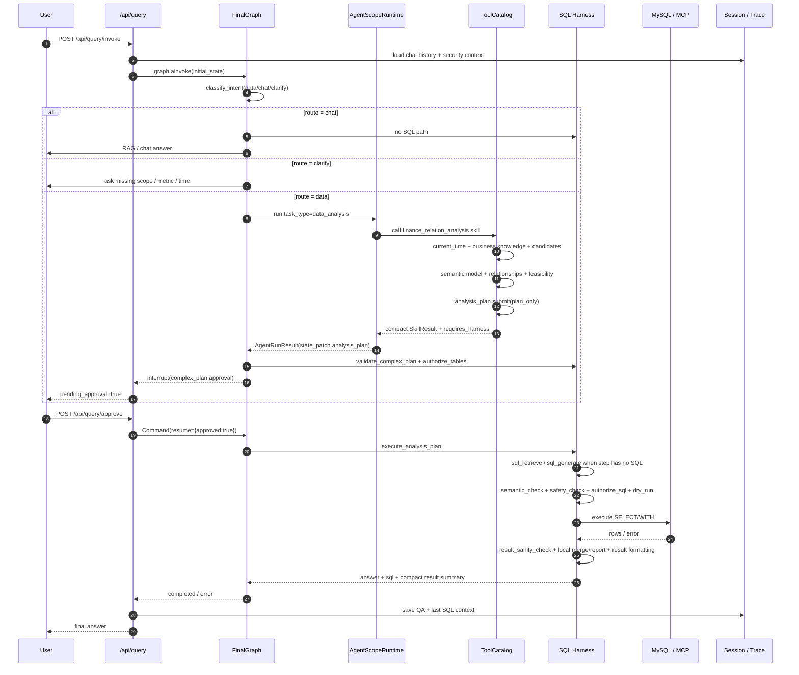
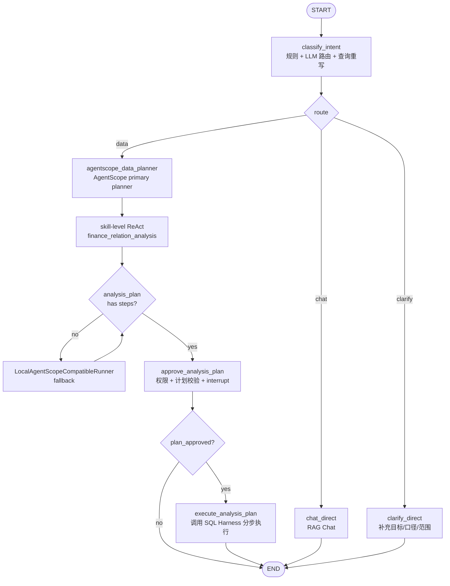
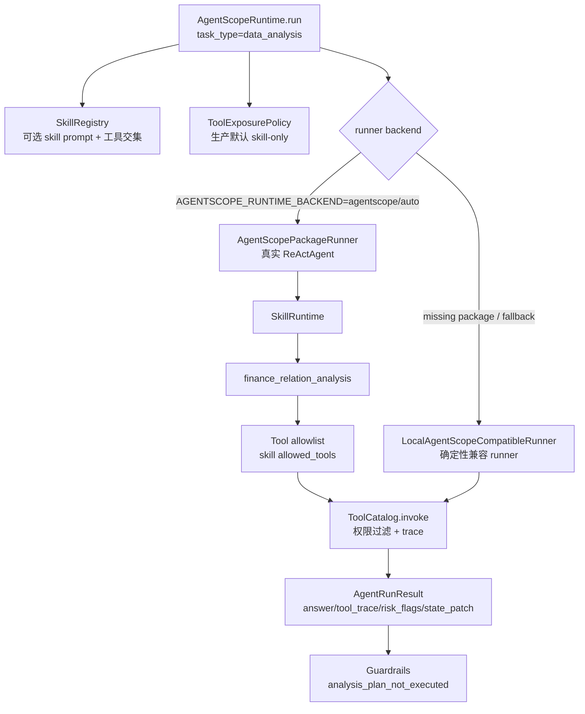
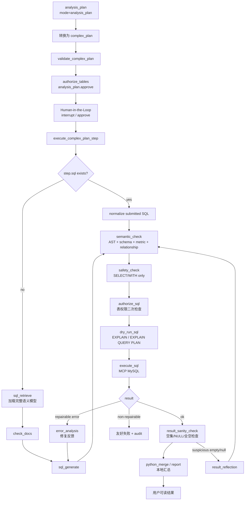
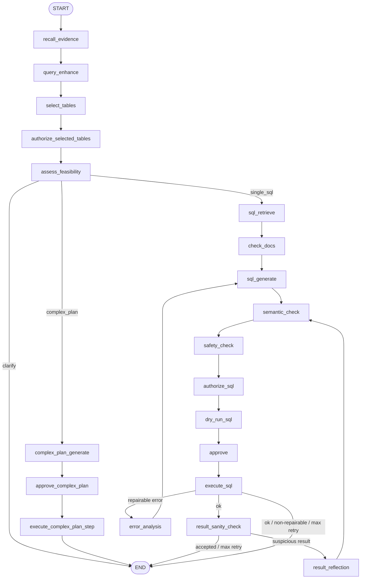
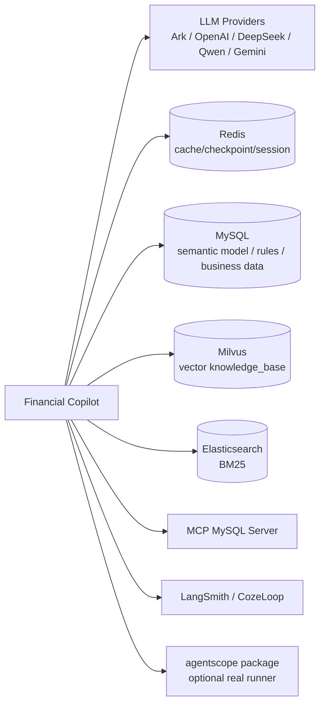

# 当前架构设计：Skill-Based AgentScope Data Planner + SQL Quality Gate

本文记录截至 2026-05-25 的当前实现架构。代码基线是 `feature/agentscope-data-planner`：`/api/query/invoke` 的 `data` 路由已由 skill 级 AgentScope data planner 作为第一规划入口，SQL 执行事实源和 SQL 正确性治理仍由 SQL Harness 控制。

## 架构结论

- 平台入口只保留三类路由：`data`、`chat`、`clarify`。
- `data` 请求进入 `agentscope_data_planner`，生产默认只向外层 ReActAgent 暴露业务 skill，例如 `finance_relation_analysis`。
- skill 内部通过 ToolCatalog 探索业务知识、表、字段语义和关系，并提交结构化 `analysis_plan`。
- AgentScope 不直接执行 SQL，不产生执行事实。它只能提交 `analysis_plan` 或草稿，后续必须进入 SQL Harness。
- SQL Harness 继续负责计划校验、表权限、SQL 语义/schema/关系校验、SQL 安全检查、SQL 权限、EXPLAIN dry-run、人工审批、MySQL 执行、结果 sanity check、错误修复、结果反思、审计和评测。
- 完整 `SQLReact` 子图仍保留，用于 legacy/direct SQL 链路和复用内部 harness 能力；当前主 `data` 路径不再先进入完整 SQLReact 选表链路。

## 总体架构

```mermaid
flowchart LR
    User([用户 / Web UI])
    API[FastAPI<br/>agents/api/app.py]
    QueryRouter[/api/query<br/>routers/query.py]
    AgentScopeAPI[/api/agentscope<br/>routers/agentscope.py]
    FinalGraph[Final Graph<br/>flow/dispatcher.py]
    RAG[RAG Chat Graph<br/>flow/rag_chat.py]
    AgentScopeRuntime[AgentScopeRuntime<br/>runtime/agentscope_runtime.py]
    SkillRuntime[SkillRuntime<br/>runtime/skill_runtime.py]
    FinanceSkill[finance_relation_analysis<br/>runtime/skills]
    ToolCatalog[ToolCatalog<br/>runtime/tool_catalog.py]
    SQLHarness[SQL Harness<br/>flow/sql_react.py]
    Security[Security + Audit<br/>tool/security]
    Model[Model Factory<br/>model/]
    Retrieval[RAG Retrieval<br/>Milvus + ES + MySQL fallback]
    Storage[(Redis / MySQL / Milvus / ES)]
    MCP[(MCP MySQL)]
    Trace[LangSmith / CozeLoop<br/>tool/trace]

    User -->|"HTTP/SSE"| API
    API --> QueryRouter
    API --> AgentScopeAPI
    QueryRouter -->|"build_final_graph"| FinalGraph

    FinalGraph -->|"route=data"| AgentScopeRuntime
    FinalGraph -->|"route=chat"| RAG
    FinalGraph -->|"route=clarify"| User

    AgentScopeRuntime -->|"skill-level visible functions"| SkillRuntime
    SkillRuntime --> FinanceSkill
    FinanceSkill -->|"allowlisted read-only tools"| ToolCatalog
    ToolCatalog -->|"business knowledge / schema / semantic / relationships"| Retrieval
    ToolCatalog -->|"permission-filtered metadata"| Security
    ToolCatalog --> Storage
    FinanceSkill -->|"analysis_plan.submit<br/>plan_only"| FinalGraph

    FinalGraph -->|"approve_analysis_plan"| Security
    FinalGraph -->|"execute_analysis_plan"| SQLHarness
    SQLHarness -->|"semantic / safety / authorize / dry-run / approve / execute / sanity"| Security
    SQLHarness -->|"execute SELECT/WITH"| MCP
    SQLHarness -->|"semantic model / relationships / evidence"| Storage

    RAG --> Retrieval
    RAG --> Model
    AgentScopeRuntime --> Model
    SQLHarness --> Model
    API --> Trace
    FinalGraph --> Trace
    AgentScopeRuntime --> Trace
    SQLHarness --> Trace
```

## 主请求生命周期



## 当前 Final Graph



## AgentScope Data Planner 内部边界



`data_analysis` 外层 ReActAgent 生产默认可见函数：

| 函数 | 作用 | 边界 |
|------|------|------|
| `finance_relation_analysis` | 对收入、成本、预算、回款、费用、利润、亏损等财务关系问题做取证、复杂度判断并提交 `analysis_plan` | 不执行 SQL；只返回 compact observation 给外层 LLM |

`finance_relation_analysis` skill 内部允许的 primitive tools：

| 工具 | 作用 | 边界 |
|------|------|------|
| `business_knowledge.search` | 查业务术语、公式、口径和相关表提示 | 只读召回，不选最终表 |
| `schema.list_tables` | 列出当前用户可见表 | 按表权限过滤；默认 skill 流程不主动调用 |
| `schema.select_candidates` | 基于 query 和 evidence 选择候选表 | 只返回候选，不执行 SQL |
| `schema.related_tables` | 读取候选表关系 | 只返回授权表内关系 |
| `semantic_model.search` | 读取候选表字段语义 | 关系图剪枝后只加载当前计划需要的表；可复用 `workflow_state` |
| `plan.assess_feasibility` | 基于规则和关系图判断 single_sql / plan_execute / clarify | 不调用 LLM |
| `current_time.now` | 解析相对时间 | 不读取业务数据 |
| `analysis_plan.submit` | 提交结构化分析计划 | `plan_only`，必须回 SQL Harness |

`finance_relation_analysis` 的复杂度判断和步骤生成遵循证据驱动原则：

- `plan.assess_feasibility` 的任务类型来自可配置 route rules 或 `recall_context`，再结合关系图连通性/JOIN 风险，不在 Python 中写固定财务关键词分支。
- 业务知识中的 `formula` 只作为口径说明，不参与“该术语是否命中用户问题”的表范围匹配；命中判断以术语名和同义词为主，避免公式文本污染选表。
- `single_sql` 会先收敛到直接命中的主业务证据组，再选择最佳可执行连通组件，例如“去年亏损”只保留凭证主表、凭证分录和会计科目。
- `plan_execute` 按业务术语的 `关联表` 和主事实表分组，同一事实表上的多个指标会合并，并只补直接相连的维表或桥表。

## SQL Harness 分步执行



## 保留的完整 SQLReact 子图

完整 SQLReact 图仍存在，职责是严格 NL2SQL harness 和内部复用。它从 `recall_evidence` 开始，包含选表、可行性判断、单 SQL、复杂计划、审批、执行、修复和反思。



## 状态与事实源

| 状态 | 所属 | 用途 | 是否执行事实源 |
|------|------|------|----------------|
| `FinalGraphState` | `flow/state.py` | API 主请求、路由、AgentScope 计划、审批恢复 | 是，承载主请求状态 |
| `AgentRunResult.state_patch` | `runtime/result.py` | AgentScope 输出计划、候选表、展示状态 | 否，需要回写并经 Harness 校验 |
| `analysis_plan` | AgentScope -> FinalGraph | 结构化计划，`plan_only` | 否 |
| `complex_plan` | SQL Harness | 可审批、可执行的分步计划 | 是，审批后执行 |
| `SQLReactState` | `flow/state.py` | SQL 生成、权限、安全、执行、修复、反思 | 是，SQL 执行事实源 |
| `semantic_report` / `dry_run_report` / `result_sanity_report` | SQL Harness | SQL Quality Gate 分阶段报告，审批卡和 trace 使用 | 是，SQL 治理事实源 |
| `execution_history` / audit | SQL Harness + security | 审计、排障、评测 | 是 |

## API 面

| API | 当前用途 |
|-----|----------|
| `POST /api/query/classify` | 单独运行 `classify_intent`，返回 `data/chat/clarify` 和 `rewritten_query` |
| `POST /api/query/invoke` | 主入口；构建安全上下文、加载会话、运行 FinalGraph |
| `POST /api/query/approve` | 恢复 LangGraph interrupt，继续 SQL 或复杂计划执行 |
| `POST /api/query/approve/stream` | 审批后的 SSE 执行流 |
| `POST /api/agentscope/complex-analysis` | AgentScope 侧复杂分析工作区入口，返回 draft/plan，不执行 SQL |

## 外部依赖



## 关键文件

| 文件 | 职责 |
|------|------|
| `agents/api/routers/query.py` | 主查询、审批、SSE API，负责 security context、session 和 graph resume |
| `agents/flow/dispatcher.py` | FinalGraph：`classify_intent -> data/chat/clarify`，AgentScope plan handoff，计划审批与执行 |
| `agents/runtime/agentscope_runtime.py` | AgentScopeRuntime，上下文、工具 allowlist、trace、guardrail 和结果结构化 |
| `agents/runtime/agentscope_adapter.py` | 真实 AgentScope adapter 与本地兼容 runner |
| `agents/runtime/skill_runtime.py` | 可执行 skill 调度器，负责 skill span、child tool trace 和 compact observation |
| `agents/runtime/skills/finance_relation_analysis.py` | 财务关系分析 skill，内部取证、复杂度判断并提交 `analysis_plan` |
| `agents/runtime/tool_exposure_policy.py` | 控制每次模型调用可见函数，生产默认 data_analysis skill-only |
| `agents/runtime/tool_catalog.py` | 受控工具合同、权限过滤、计划提交、SQL 草稿提交 |
| `agents/flow/sql_react.py` | SQL Harness：召回、选表、SQL 生成、安全、权限、审批、执行、修复、复杂计划 |
| `agents/tool/sql_tools/semantic_check.py` | SQL Quality Gate pipeline：AST、schema、metric、relationship 等报告汇总 |
| `agents/tool/sql_tools/verified_query_repository.py` | 已验证 SQL 资产存储与 regression/eval 导出 |
| `agents/tool/security/policies.py` | 表级权限判断和审计事件构建 |
| `agents/tool/trace/tracing.py` | LangSmith/CozeLoop callback 和 traced tool call |

## 最新真实链路验证

使用真实本地 API 验证过当前主链路：

- `POST /api/query/invoke`，`route=data`，问题“2025年按部门分析预算执行率，并对比已审批报销费用与预算差异”返回 `pending_approval=true`，`approval_type=complex_plan`。
- 真实 HTTP E2E：问题“去年亏损”返回复杂计划审批；审批后 `POST /api/query/approve/stream` 返回 `status=completed`，答案包含 `亏损金额：617000.00`。
- 生成 SQL 正确包含 `JOIN t_journal_entry je ON ji.entry_id = je.id`，并经过 `semantic_check`、`safety_check`、`authorize_sql`、`dry_run_sql` 和 `result_sanity_check`。
- 缺少 `t_journal_entry` 表权限时，审批执行返回业务可读的权限拒绝。
- 补齐 `t_journal_entry` 权限后，审批执行返回 `status=completed`，SQL 通过质量门、权限检查并执行，最终输出结果。

## 设计约束

- AgentScope 输出永远不能绕过 SQL Harness。
- 任何 SQL 都必须经过 `semantic_check -> safety_check -> authorize_sql -> dry_run_sql -> approve -> execute_sql -> result_sanity_check`。
- 权限拒绝不暴露不该展示的物理表细节，返回业务可读提示并写入 no-throw audit。
- AgentScope real runner 可失败或不提交计划，FinalGraph 会 fallback 到本地兼容 runner，避免 data 主链路直接暴露 ReAct chatter。
- `analysis_plan.submit` 允许规范化半结构化计划，但输出仍是 `plan_only`。
- 当前 `data` 主链路优先规划，不代表 SQLReact 被删除；SQLReact 仍是执行控制面和兼容子图。
- Verified Query Repository 只能作为回归/eval 资产，不能作为执行白名单，不能绕过质量门、权限或审批。
