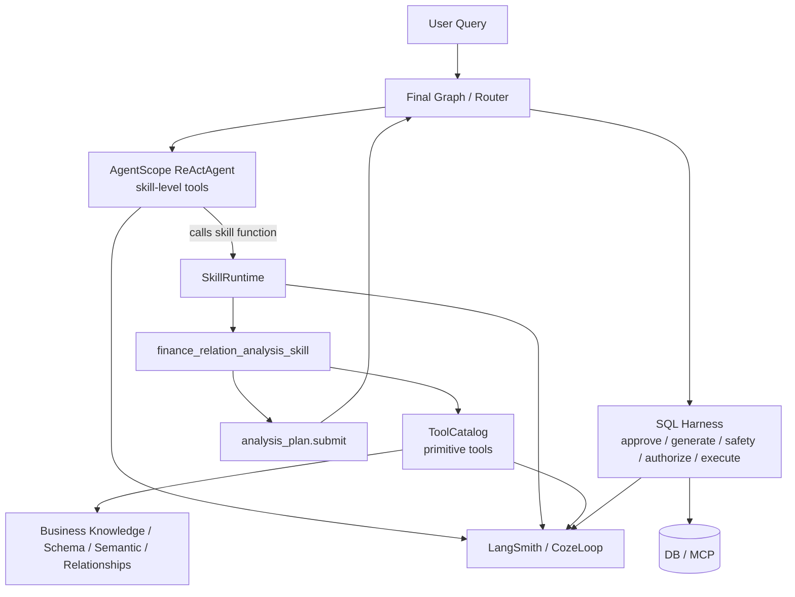
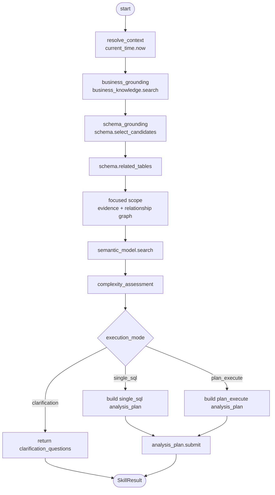

# Skill-Based DataAgent Runtime 技术设计

更新时间：2026-05-24

本文档描述 DataAgent/AgentScope 数据分析运行时从“ReActAgent 直接调用 primitive tools”演进到“ReActAgent 调用业务 skill”的技术设计和当前实现状态。迭代背景和任务拆分见 [iterations.md](iterations.md) 中的 `Skill 作为 ReActAgent 的能力调用单元`。

## 1. 背景

当前 data_analysis 主链路已经形成以下边界：

```text
User Query
  -> Final Graph / Dispatcher
  -> AgentScope data planner
  -> analysis_plan.submit
  -> SQL Harness approve / generate / safety / authorize / execute
```

真实 AgentScope package runner 使用 ReActAgent。早期实现直接向 ReActAgent 暴露 data_analysis 的多个 ToolCatalog 工具，例如业务知识召回、SQL 示例召回、schema、semantic model、表关系、SQL 预检查和 analysis plan handoff。

这种方式的主要问题：

1. 每轮 LLM reasoning 都可能携带大量 tool schema，token 成本高。
2. LLM 在 primitive tool 粒度上自由规划，容易重复调用 schema/describe/semantic 工具。
3. trace 中工具调用过细，难以看出“业务能力流程”。
4. 复杂查询如果让 LLM 一次性生成大 join SQL，字段和关系幻觉风险高。
5. DataAgent 不只是 NL2SQL，还需要指标口径、数据发现、分析规划、报告和多步执行协同。

因此，目标不是把 ToolCatalog 移除，而是把 ToolCatalog 下沉到 skill runtime，让外层 ReActAgent 默认只看少量业务 skill。

当前实现已经采用这个方向：`data_analysis` 的真实 AgentScope package runner 默认只向外层 ReActAgent 暴露 `finance_relation_analysis` 一个 executable skill。底层 `schema.select_candidates`、`semantic_model.search`、`schema.related_tables`、`analysis_plan.submit` 等 primitive tools 仍存在，但由 skill runtime 内部按流程调用。

## 2. 目标与非目标

### 目标

- ReActAgent 默认调用 skill，而不是直接编排底层 primitive tools。
- skill 内部可以按固定流程或受控局部决策调用 ToolCatalog。
- `finance_relation_analysis_skill` 支持收入、成本、预算、回款、费用关系分析。
- 复杂查询必须先做复杂度判断；多表、多事实、多口径场景走 Plan Execute React，而不是生成单条大 join SQL。
- SQL Harness 继续负责审批、安全、授权、执行、repair 和结果合并。
- LangSmith trace 能清晰区分 agent reasoning、skill、child tools 和 SQL Harness。
- 降低每轮 LLM input token，减少不必要 reasoning 调用。

### 非目标

- 不把 SQL 执行能力下放给 AgentScope skill。
- 不用一个大 prompt 替代现有 ToolCatalog、权限和 SQL Harness。
- 不移除现有 primitive tools；它们仍供 skill runtime、debug 和兼容链路使用。
- 不要求所有数据分析场景一次性 skill 化，先从高频财务关系分析落地。

## 3. 概念模型

| 概念 | 定义 | 例子 |
|---|---|---|
| `tool` | 原子能力，通常是一次 ToolCatalog 调用 | `schema.select_candidates`、`semantic_model.search` |
| `skill` | 面向业务任务的能力 contract，内部可调用多个 tools | `finance_relation_analysis_skill` |
| `SkillRuntime` | skill 执行器，负责工具调用、trace、压缩 observation | `invoke_skill(...)` |
| `ReActAgent` | 外层能力选择器，默认只看到 skill function | `finance_relation_analysis(...)` |
| `SQL Harness` | SQL 事实源控制面 | approve、safety、authorize、execute |

skill 不应只是 prompt。一个可执行 skill 由以下部分组成：

```text
skill = contract + allowed_tools + workflow/state machine + compact output + trace policy
```

## 4. 目标架构



外层 ReActAgent 可见函数示例：

```text
finance_relation_analysis
metric_definition_lookup
budget_variance_analysis
artifact_report
clarification_request
```

外层 ReActAgent 默认不可见：

```text
schema.select_candidates
semantic_model.search
schema.related_tables
sql.safety_check
sql.authorize_draft
analysis_plan.submit
```

这些 primitive tools 由 skill runtime 内部调用。

## 5. Skill Contract

建议新增或扩展以下 contract。

```python
@dataclass(frozen=True, slots=True)
class RuntimeSkill:
    name: str
    version: str
    description: str
    input_schema: dict[str, Any]
    output_schema: dict[str, Any]
    task_types: tuple[str, ...]
    allowed_tools: tuple[str, ...]
    execution_modes: tuple[str, ...]
    trace_policy: SkillTracePolicy


@dataclass(frozen=True, slots=True)
class SkillTracePolicy:
    expose_child_tool_trace_to_llm: bool = False
    observation_mode: str = "summary"
    max_observation_chars: int = 4000
    max_evidence_items: int = 8


@dataclass(slots=True)
class SkillResult:
    status: str
    skill_name: str
    skill_version: str
    execution_mode: str
    summary: str
    evidence: list[str]
    analysis_plan: dict[str, Any] = field(default_factory=dict)
    clarification_questions: list[str] = field(default_factory=list)
    artifacts: dict[str, Any] = field(default_factory=dict)
    trace_refs: list[str] = field(default_factory=list)
    risk_flags: list[dict[str, Any]] = field(default_factory=list)
```

统一状态：

| status | 含义 |
|---|---|
| `plan_ready` | 已提交或可提交 analysis_plan |
| `needs_clarification` | 缺少时间、主体、粒度或业务口径 |
| `failed` | skill 执行失败，返回可诊断错误 |

统一 execution mode：

| execution_mode | 含义 |
|---|---|
| `single_sql` | 可由 SQL Harness 后续生成单步 SQL |
| `plan_execute` | 需要多步计划执行和合并 |
| `clarification` | 需要用户补充信息 |

## 6. Tool 可见性与权限

工具可见性按交集计算：

```text
runtime task allowlist
∩ security context allowed tools/tables
∩ skill allowed_tools
∩ stage/previous-step policy
```

原则：

- skill 可以收窄工具，但不能扩大 runtime/security 已允许的范围。
- 外层 ReActAgent 看到的是 skill function schema。
- skill 内部调用 ToolCatalog 时仍走 `AgentScopeRunContext.invoke_tool()`，复用现有权限、缓存和 trace。
- debug 模式可以临时暴露 primitive tools，但必须通过配置显式开启。

当前落地文件：

| 文件 | 职责 |
|---|---|
| `agents/runtime/tool_exposure_policy.py` | 计算每轮模型调用可见函数；生产默认 `data_analysis -> finance_relation_analysis`。 |
| `agents/runtime/agentscope_adapter.py` | 构建 AgentScope toolkit，并通过 `_TracingModelProxy` 在真实 LLM call 前过滤 tool schema。 |
| `agents/runtime/agentscope_runtime.py` | 创建 `AgentScopeRunContext`，选择 skills，注入 `ToolExposurePolicy`，并在最终 reply 后组装 `AgentRunResult`。 |
| `agents/runtime/skill_registry.py` | 同时注册 prompt-only skill 和 executable skill；`finance_relation_analysis` 来自 runtime contract。 |

生产默认行为：

```text
task_type=data_analysis
expose_data_analysis_primitive_tools=false
visible_functions=["finance_relation_analysis"]
```

debug primitive 行为：

```text
task_type=data_analysis
expose_data_analysis_primitive_tools=true
start -> current_time.now, business_knowledge.search, schema.select_candidates
after business_knowledge.search -> schema.select_candidates
after schema.select_candidates -> schema.related_tables, semantic_model.search, analysis_plan.submit
after schema.related_tables -> semantic_model.search, analysis_plan.submit
```

环境变量 `AGENTSCOPE_TOOL_EXPOSURE_POLICY_JSON` 可覆盖最小策略，例如：

```json
{
  "data_analysis": {
    "skill_names": ["finance_relation_analysis"],
    "primitive_stages": {
      "start": ["current_time.now", "business_knowledge.search", "schema.select_candidates"],
      "schema.select_candidates": ["schema.related_tables", "semantic_model.search", "analysis_plan.submit"]
    }
  }
}
```

## 7. `finance_relation_analysis_skill`

### 适用场景

```text
2025年按部门分析预算执行率，并对比已审批报销费用与预算差异
分析当前公司预算执行和报销费用差异
按部门分析预算执行、费用报销和差异原因
去年公司亏损原因
```

### 输入

```json
{
  "query": "2025年按部门分析预算执行率，并对比已审批报销费用与预算差异",
  "session_id": "web_xxx",
  "security_context": {},
  "workflow_state": {},
  "constraints": {
    "time_range": null,
    "grain": null,
    "budget_status": ["已审批", "执行中"],
    "cash_vs_accrual": null
  }
}
```

### 内部流程



当前实现位于 `agents/runtime/skills/finance_relation_analysis.py`。它是代码状态机，不是把所有业务逻辑写进一个大 prompt：

1. `current_time.now` 解析相对时间上下文。
2. `business_knowledge.search` 召回净利润、预算差异、回款效率等业务证据。
3. `schema.select_candidates` 根据 query 和 evidence 选择候选表。
4. `schema.related_tables` 获取候选表关系。
5. focused scope 根据业务证据和关系图剪枝，避免单指标查询被无关事实表污染。
6. `semantic_model.search` 只加载剪枝后的当前计划表字段语义。
7. `plan.assess_feasibility` 做复杂度/可执行性判断。
8. 根据 query 和可行性输出 `single_sql`、`plan_execute` 或 `clarification`。
9. `analysis_plan.submit` handoff 到 SQL Harness。

当前复杂 SQL 判断不使用 Python 财务关键词元组。任务类型优先来自可配置 route rules，其次来自 `recall_context` 中命中的业务术语、相关表和通用分析动作信号，最后再用 relationship graph 的连通性和 JOIN 风险兜底。业务知识的 `formula` 只作为口径说明，不参与术语命中判断，避免“公式里出现费用/预算”污染选表。

计划表范围收敛规则：

- `single_sql`：选择与用户 query 直接命中的主业务证据组，再保留该组内最佳可执行连通组件。
- `plan_execute`：按业务术语 `关联表` 的主事实表分组，同主事实表的指标合并为一个 SQL step。
- 分组只补直接相连的维表或桥表，不跨事实组扩展。

当前 skill allowlist：

```text
current_time.now
business_knowledge.search
schema.list_tables
schema.select_candidates
semantic_model.search
schema.related_tables
plan.assess_feasibility
analysis_plan.submit
```

`schema.list_tables` 在 allowlist 中是为了兼容 runtime/security 可见表发现；默认 skill 流程不主动调用它。

### 输出示例

```json
{
  "status": "plan_ready",
  "skill_name": "finance_relation_analysis_skill",
  "skill_version": "2026-05-24",
  "execution_mode": "plan_execute",
  "summary": "已根据收入、成本、费用、预算和回款口径生成多步分析计划，并交给 SQL Harness 审批执行。",
  "evidence": [
    "净利润口径：收入 - 成本 - 费用",
    "预算差异口径：actual_amount - budget_amount",
    "回款效率可通过应收/已结金额衡量",
    "候选表包括 t_budget、t_journal_entry、t_journal_item、t_account、t_expense_claim、t_receivable_payable"
  ],
  "analysis_plan": {
    "mode": "analysis_plan",
    "execution_mode": "plan_execute",
    "steps": []
  },
  "clarification_questions": [],
  "trace_refs": []
}
```

## 8. 复杂度判断

复杂度判断是 `finance_relation_analysis_skill` 的关键阶段。不能固定把所有问题都提交成单步 SQL，也不能所有问题都强行拆分。

### 判断输入

```text
- rewritten/current query
- business knowledge evidence
- selected_tables
- semantic_model_summary
- relationships
- security scope
- requested metrics
- requested grain
```

### 判断规则

倾向 `single_sql`：

- 只涉及 1-2 张强关系表。
- 指标口径简单。
- 粒度明确。
- 不需要跨多个事实表合并。

倾向 `plan_execute`：

- 涉及收入、成本、预算、回款、费用等多个事实域。
- 多张事实表之间没有直接、稳定、同粒度 join key。
- 需要先分指标汇总，再按公共粒度合并。
- 需要同时比较权责发生制和收付实现制。
- 需要预算 vs 实际、收入 vs 回款、成本费用 vs 利润等多口径组合。

倾向 `clarification`：

- 缺少时间范围，且“当前/去年/本期”等无法从上下文可靠解析。
- 缺少主体或公司范围。
- 缺少分析粒度，且不同粒度会改变结论。
- 权责发生和收付实现制是否区分会显著影响结果。

### 输出

```json
{
  "can_single_sql": false,
  "can_decompose": true,
  "execution_mode": "plan_execute",
  "reasons": [
    "收入、预算、回款、费用来自不同事实表",
    "一次性多表 join 容易产生字段和关系幻觉",
    "适合先按期间/成本中心分别汇总后合并"
  ],
  "recommended_grain": ["period", "cost_center_id"],
  "risky_joins": [],
  "missing_fields": []
}
```

## 9. Plan Execute React

当 `execution_mode=plan_execute` 时，skill 产出多步 plan，而不是 SQL。

```json
{
  "mode": "analysis_plan",
  "execution_mode": "plan_execute",
  "steps": [
    {
      "step": 1,
      "type": "sql",
      "goal": "按期间和成本中心统计收入",
      "tables": ["t_journal_entry", "t_journal_item", "t_account", "t_cost_center"],
      "grain": ["period", "cost_center_id"],
      "depends_on": [],
      "merge_keys": ["period", "cost_center_id"]
    },
    {
      "step": 2,
      "type": "sql",
      "goal": "按期间和成本中心统计成本与费用",
      "tables": ["t_journal_entry", "t_journal_item", "t_account", "t_expense_claim", "t_cost_center"],
      "grain": ["period", "cost_center_id"],
      "depends_on": [],
      "merge_keys": ["period", "cost_center_id"]
    },
    {
      "step": 3,
      "type": "sql",
      "goal": "按期间和成本中心统计预算与实际",
      "tables": ["t_budget", "t_cost_center"],
      "grain": ["budget_year", "budget_month", "cost_center_id"],
      "depends_on": [],
      "merge_keys": ["period", "cost_center_id"]
    },
    {
      "step": 4,
      "type": "python_merge",
      "goal": "合并收入、成本、费用、预算、回款并计算关系指标",
      "depends_on": [1, 2, 3],
      "merge_keys": ["period", "cost_center_id"]
    },
    {
      "step": 5,
      "type": "report",
      "goal": "输出关系分析结论、异常点和后续追查建议",
      "depends_on": [4]
    }
  ],
  "requires_user_confirmation": true
}
```

后续执行流程：

```text
approve_analysis_plan
  -> execute_analysis_plan
      -> per-step sql_generate
      -> sql.normalize
      -> sql.safety_check
      -> authorize_sql
      -> execute_sql
      -> repair retry
      -> merge
      -> report
```

## 10. SQL Harness 边界

必须保持以下边界：

| 能力 | 归属 | 说明 |
|---|---|---|
| 业务取证 | skill runtime | 只读工具 |
| 复杂度判断 | skill runtime | 产出 mode，不执行 SQL |
| analysis_plan 提交 | skill runtime -> dispatcher | handoff |
| 计划审批 | SQL Harness / dispatcher | 可 interrupt |
| SQL 生成 | SQL Harness | 每个 step 独立生成 |
| SQL safety | SQL Harness | 不由外层 Agent 决定 |
| SQL authorize | SQL Harness | 使用 security context |
| SQL execute | SQL Harness | 唯一执行事实源 |
| repair retry | SQL Harness | 基于执行错误修复 |
| merge/report | SQL Harness / report node | 基于已执行结果 |

`sql.safety_check` 和 `sql.authorize_draft` 不应作为真实 data_analysis ReActAgent 的默认可见 skill/tool。它们可以作为 SQL Harness 内部步骤或 debug 工具存在。

当前实际链路：

```text
User Query
  -> dispatcher / agentscope_data_planner
  -> AgentScope ReActAgent sees finance_relation_analysis
  -> SkillRuntime.invoke_skill("finance_relation_analysis")
  -> primitive ToolCatalog evidence flow
  -> analysis_plan.submit
  -> dispatcher extracts state_patch.analysis_plan
  -> approve_analysis_plan
  -> sql_harness.approve_analysis_plan
  -> user approval
  -> execute_analysis_plan
  -> sql_harness.execute_analysis_plan
```

注意：`analysis_plan.submit` 只保存计划和 handoff 状态，不执行 SQL。审批前 API 应返回 `pending_approval`。SQL 生成、安全检查、授权、执行、repair 和合并都发生在 SQL Harness 阶段。

## 11. Trace 设计

当前目标 LangSmith 结构：

```text
agentscope.llm.data_analysis_agent.reasoning
  metadata.visible_functions = ["finance_relation_analysis", ...]

agentscope.skill.finance_relation_analysis
  metadata.skill_name = "finance_relation_analysis"
  metadata.skill_version = "2026-05-24"
  metadata.execution_mode = "plan_execute"

agentscope.tool.current_time.now
agentscope.tool.business_knowledge.search
agentscope.tool.schema.select_candidates
agentscope.tool.semantic_model.search
agentscope.tool.schema.related_tables
agentscope.tool.analysis_plan.submit

route_after_agentscope_data_planner
approve_analysis_plan
sql_harness.approve_analysis_plan
execute_analysis_plan
sql_harness.execute_analysis_plan
```

span metadata 建议：

```json
{
  "real_call": true,
  "span_layer": "skill",
  "skill_name": "finance_relation_analysis",
  "skill_version": "2026-05-24",
  "execution_mode": "plan_execute",
  "visible_functions": ["finance_relation_analysis"],
  "child_tool_count": 6
}
```

约束：

- skill span 是真实 runtime 执行，不伪装成 LLM。
- 不再基于最终 `tool_trace` 追加 `agentscope.react.*` 或 `agentscope.plan.*` 伪节点。
- tool span output 保留完整结构化输出。
- 返回给 LLM 的 skill observation 只保留 compact summary。

`AgentRunResult` 的组装不发生在每次 tool 调用后。当前时序是：

```text
ReActAgent reasoning
  -> calls skill function
  -> SkillRuntime records context.tool_trace/context.events
  -> ReActAgent returns final assistant reply
  -> AgentScopePackageRunner._convert_reply(...)
  -> AgentScopeRuntime.run(...) merges context.tool_trace/context.events/state_patch
  -> AgentRunResult
```

也就是说，LLM 不需要理解 `AgentRunResult` 这个 Python 类型；它只需要返回简洁 answer、plan 或 clarification。完整 `tool_trace`、`events`、`risk_flags`、`state_patch` 由 runtime 组装。

## 12. 成本控制

成本控制点：

1. 外层 Agent 只看到 skill schema，不看到 primitive tool schema。
2. skill function input/output schema 控制在小范围内。
3. child tool output 不直接追加给外层 LLM。
4. semantic model 和 table metadata 使用 summary。
5. ReActAgent 最大迭代数按 task/skill 配置。
6. 高频 deterministic skill 流程优先用代码状态机，不每一步都调用 LLM。

验收指标：

```text
outer_agent_visible_function_count <= 5
outer_agent_tool_schema_json_chars < 当前 primitive tool 暴露方案
finance_relation_analysis_skill observation chars <= 4000
data_analysis max reasoning iterations <= 5
```

当前诊断脚本：

```bash
.venv/bin/python scripts/diagnose_tool_exposure.py
```

当前实测基线：

```text
skill_only: function_count=1, schema_chars=652, estimated_tokens=152
primitive_debug_start_visible: function_count=3, schema_chars=1603, estimated_tokens=368
primitive_debug_registered: function_count=6, schema_chars=2820, estimated_tokens=642
```

这组数字只统计工具 schema 近似 token，不等同于整次 LLM input token，但可以稳定观察工具暴露策略是否回退到全量 primitive tools。

## 13. 当前实现清单

| 模块 | 文件 | 当前状态 |
|---|---|---|
| Skill contract | `agents/runtime/skill_contracts.py` | 已实现 `RuntimeSkill`、`SkillTracePolicy`、`SkillResult`、`ExecutableSkill`。 |
| Skill runtime | `agents/runtime/skill_runtime.py` | 已实现 `invoke_skill()`，记录 `agentscope.skill.*` span 和 child tool count。 |
| Finance skill | `agents/runtime/skills/finance_relation_analysis.py` | 已实现财务关系取证、复杂度分流、plan submit。 |
| Skill registry | `agents/runtime/skill_registry.py` | 已支持 `prompt` / `executable` 两类 skill，builtin 注册 `finance_relation_analysis`。 |
| Tool exposure | `agents/runtime/tool_exposure_policy.py` | 已支持生产 skill-only、debug primitive stage policy、env JSON override、schema diagnostics。 |
| AgentScope adapter | `agents/runtime/agentscope_adapter.py` | 已接入 skill toolkit、visible tool filtering、真实 LLM reasoning span。 |
| Runtime wiring | `agents/runtime/agentscope_runtime.py` | 已将 `ToolExposurePolicy` 注入 runner，并在最终 reply 后组装 `AgentRunResult`。 |
| SQL Harness trace | `agents/flow/dispatcher.py` | 已补 `sql_harness.approve_analysis_plan` 和 `sql_harness.execute_analysis_plan` span。 |
| Diagnostics | `scripts/diagnose_tool_exposure.py` | 已可输出 skill-only / primitive-debug schema 大小对比。 |

## 14. 验证记录

单测覆盖：

```bash
.venv/bin/python -m pytest \
  tests/test_tool_exposure_policy.py \
  tests/test_skill_registry.py \
  tests/test_skill_runtime.py \
  tests/test_agentscope_adapter.py \
  tests/test_agentscope_runtime.py \
  tests/test_dispatcher.py \
  tests/test_tracing.py -q
```

最新聚焦结果：`109 passed`。

全量相关测试历史结果：`236 passed`。

真实接口验证：

```text
去年亏损 -> pending_approval, execution_mode=single_sql
2025年按部门分析预算执行率，并对比已审批报销费用与预算差异 -> pending_approval, execution_mode=plan_execute
```

LangSmith 验证点：

```text
agentscope.llm.data_analysis_agent.reasoning visible_functions/tool_names contains finance_relation_analysis only
agentscope.skill.finance_relation_analysis child_tool_count=7
agentscope.tool.analysis_plan.submit before sql_harness.approve_analysis_plan
sql_harness.approve_analysis_plan appears after AgentScope handoff
```

## 15. 迁移计划

### Phase 1：Contract

- 新增 `RuntimeSkill`、`SkillResult`、`SkillTracePolicy`。
- 扩展 `SkillRegistry` 支持 executable skill。
- 单测固定 skill allowlist 只能收窄 ToolCatalog。

### Phase 2：SkillRuntime

- 实现 `invoke_skill()`。
- skill 内部调用 `AgentScopeRunContext.invoke_tool()`。
- 复用缓存、权限、trace 和 callback。

### Phase 3：Finance Relation Skill

- 实现固定取证流程。
- 实现复杂度判断。
- 产出 `single_sql` / `plan_execute` / `clarification`。

### Phase 4：AgentScope Adapter

- data_analysis package runner 默认暴露 skill functions。
- primitive tools 只在 skill runtime 内部可见。
- debug 配置允许临时暴露 primitive tools。

### Phase 5：SQL Harness 回归

- 验证 skill 只提交 plan。
- 验证审批和执行仍走 dispatcher/sql_react。
- 验证复杂计划逐 step 生成和执行。

### Phase 6：Trace 与 LangSmith 验收

- 增加 `agentscope.skill.*` span。
- 标记 span layer 和真实/合成状态。
- 用真实 query 验证：
  - `去年亏损`
  - `2025年按部门分析预算执行率，并对比已审批报销费用与预算差异`

## 16. 测试策略

| 测试文件 | 覆盖点 |
|---|---|
| `tests/test_skill_registry.py` | skill contract、allowlist、manifest 加载 |
| `tests/test_skill_runtime.py` | skill 调用 ToolCatalog、trace、compact output |
| `tests/test_skill_runtime.py` | skill runtime 调用、span metadata、compact output |
| `tests/test_agentscope_adapter.py` | 外层 Agent 可见函数、schema size、debug primitive 开关 |
| `tests/test_dispatcher.py` | analysis_plan handoff、pending approval |
| `tests/test_sql_react.py` | plan_execute per-step SQL Harness 边界 |
| `tests/test_tracing.py` | skill/tool/sql_harness span metadata |

关键回归：

```text
2025年按部门分析预算执行率，并对比已审批报销费用与预算差异
  -> finance_relation_analysis_skill
  -> execution_mode=plan_execute
  -> analysis_plan.submit
  -> pending_approval
  -> approve 后 SQL Harness 分步执行
```

## 17. 开放问题

1. 是否为更多高频场景补 executable skill，例如预算差异、回款逾期、费用归因。
2. `ToolExposurePolicy` 是否从 env JSON 升级为配置中心或管理端策略。
3. `plan.assess_feasibility` 是否继续保留为 ToolCatalog tool，还是下沉为 skill 内部纯函数/服务。
4. debug primitive 模式是否需要请求级白名单，避免生产误开。
5. skill version 是否需要进入持久化审计表，以便复盘历史结果。
